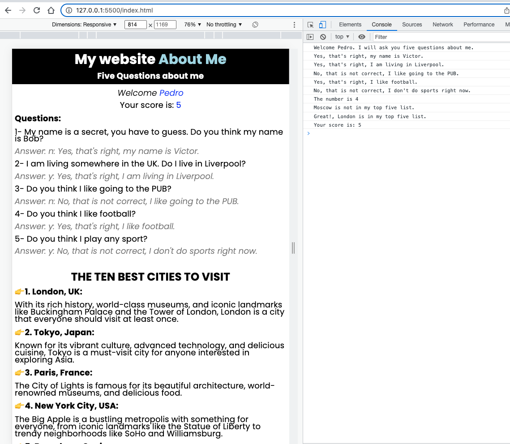

# about-me version 1

## Questions game About Me

1- My name is a secret, you have to guess. Do you think my name is Bob?  
2- I am living somewhere in the UK. Do I live in Liverpool?  
3- Do you think I'm a man?  
4- Do you think I like football?  
5- Do you think I play any sport?  

### Screenshot webpage

### Screenshot lighthouse

### WEB

[WEB link about-me](https://vmo2020.github.io/about-me/)

# about-me version 2

1. Create a “Top Ten” at the bottom of your HTML page as an ordered list in HTML. Some ideas that you can include could be top ten movies, top ten favorite places, or top ten places to visit.

**The ten best cities to visit**

2. Add a 6th question to the guessing game that takes in a numeric input by prompting the user to guess a number.

3. Add a 7th question that has multiple possible correct answers that are stored in an array.

**Guess a city to visit that is on my top ten list?**

4. Keep track of the total number of correct answers. At the end tell them how many they got correct out of the 7 questions asked.  

5. Using Lighthouse in the Chrome DevTools, analyze the accessibility of your application.

**analyze the accessibility = 100%**

### Screenshot lighthouse #2

### Screenshot webpage

